<div align="center">

# 🍽️ RestroQT

**Replace memory, paper, and WhatsApp with one real-time operating system for your entire property.**

🌐 [restroqt.com](https://restroqt.com)

<br>

[]()
[]()
[]()
[](https://restroqt.com/contact)

<br>

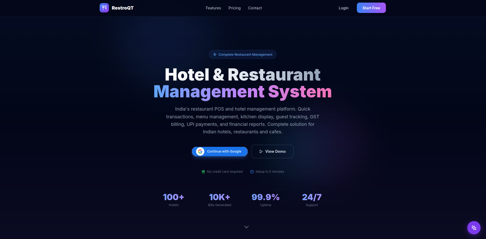

Trusted for real-time operations in modern hotels, restaurants, and cloud kitchens.  
Visit → **[restroqt.com](https://restroqt.com)**

</div>

---

## 🚀 What is RestroQT?

RestroQT is a **real-time hospitality operating system** that connects every part of your hotel or restaurant into one live dashboard — rooms, orders, kitchen, billing, cash, and guests.  
Learn more at **[restroqt.com](https://restroqt.com)**.

```
Guest orders food
    ↓
Kitchen sees it instantly
    ↓
Chef updates status
    ↓
Reception & guest see it live
    ↓
Bill generated → Cash received → Ledger updated
```

> **Everything live. Everything synced. One system.**

---

## 💰 What RestroQT Improves

- Faster table turnover → more daily revenue
- Reduced billing errors → less leakage
- Real-time order flow → faster service
- Better staff accountability → lower losses
- Zero missed orders → higher customer satisfaction

> Even a small hotel saves hours of manual coordination every day.

---

## 📱 Guests Don't Wait Anymore

Your guests can:
- Scan a QR code
- Browse the menu on their phone
- Order instantly
- Track their order live
- Pay without calling reception

> No waiting. No calling. No confusion.

---

## ⚡ Why RestroQT Is Different

Most POS systems:
- Are fragmented tools stitched together
- Require manual syncing
- Focus only on billing

RestroQT is different:

> It is a real-time operating system for the entire property.

---

## 🖥️ Product Experience

### Live Dashboard

The command center. See every room, every active guest, every live order — all on one screen.


---

### Order Management

Quick Ticket (QT) ordering for rooms & tables. Full order lifecycle: `OPEN → PREPARING → SERVED → BILLED`. Cancellations, modifications, and multi-language support included.

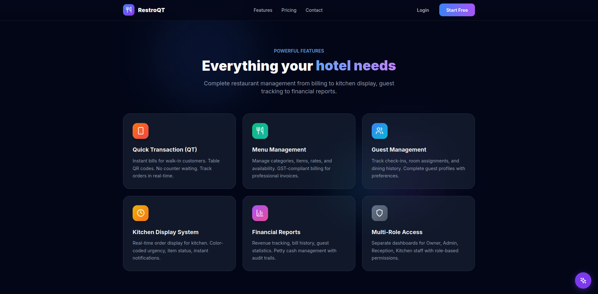

---

### Smart Billing Engine

GST/Non-GST billing, instant PDF invoices, discount support, bill history, email delivery, and bill editing *(PRO)*.

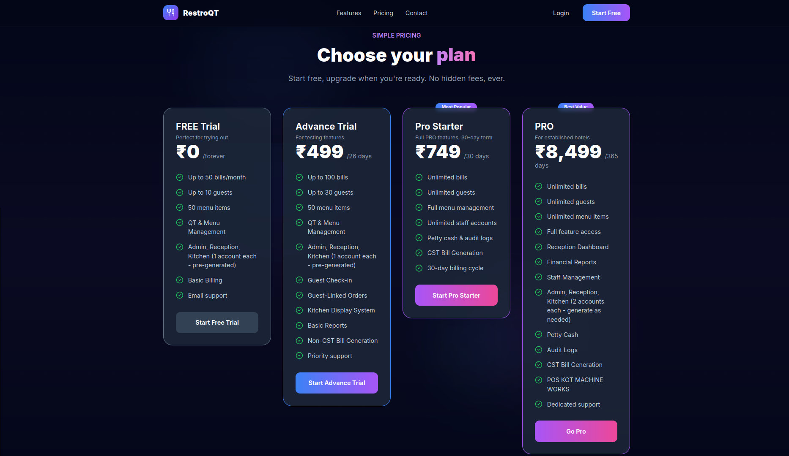

---

### Analytics & Reports

Real-time revenue tracking, order flow insights, occupancy visibility, and cash flow monitoring with CSV export *(PRO)*.

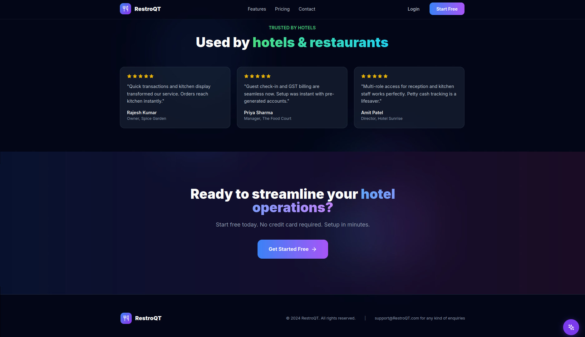

---

### 👨‍🍳 Kitchen Display System

Real-time order feed with color-coded statuses, sound alerts, one-tap updates, modification queue, and emergency mode.

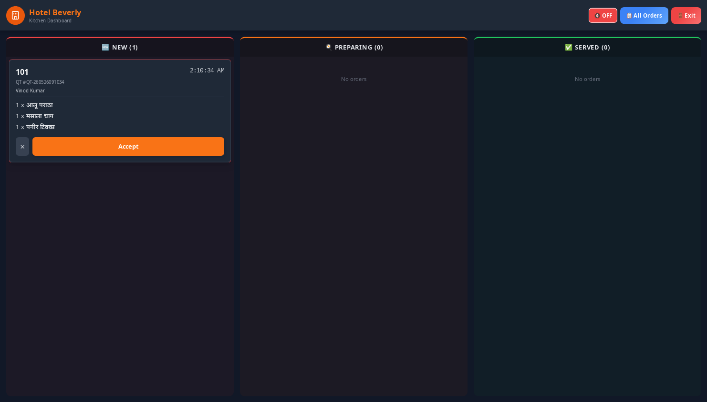
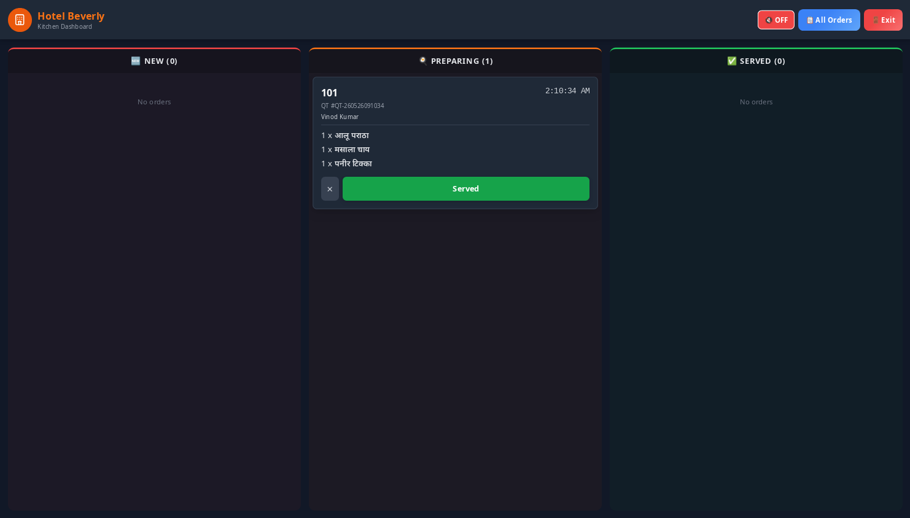

*Left: Live order feed &nbsp;|&nbsp; Right: Order detail view*

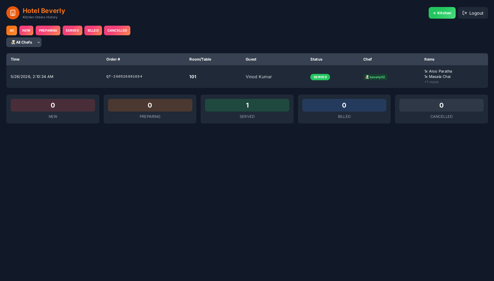

---

### 🖥️ Reception & Front Desk

Check-in guests, create orders, generate bills, manage walk-ins, and handle cash — all from one place.

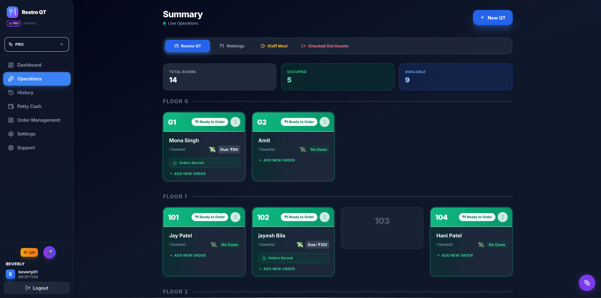
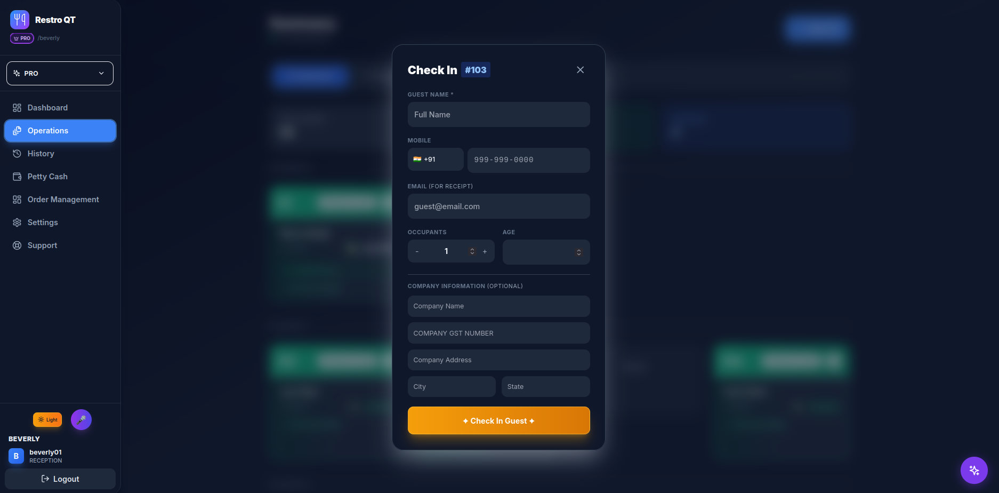

*Left: Reception dashboard &nbsp;|&nbsp; Right: Guest check-in*

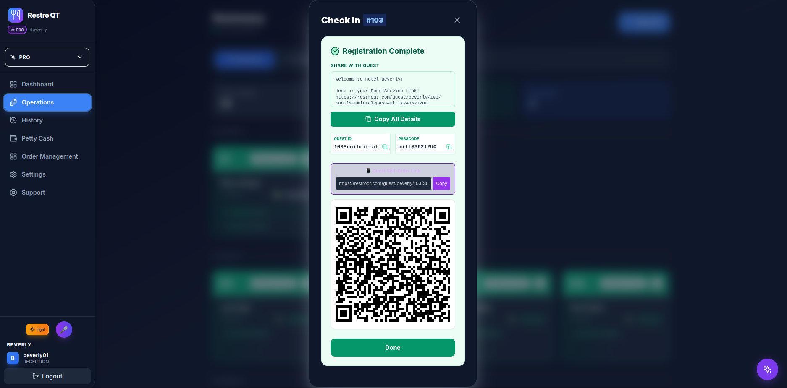
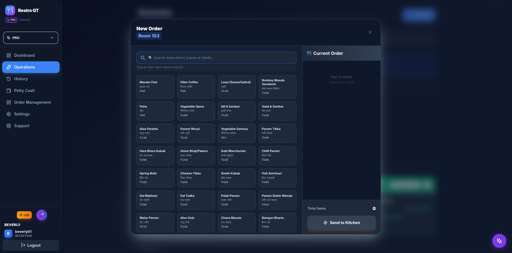

*Left: Guest management &nbsp;|&nbsp; Right: Food menu & ordering*

---

## 🔥 Core Features

### 🖥️ Live Dashboard
| Feature | Description |
|---------|-------------|
| Room Occupancy Grid | See every room — green for occupied, available for vacant |
| Active Guest Tracking | Guest names, amounts due, order statuses |
| Live Order Monitoring | Every active order with real-time status |
| Walk-in Order Alerts | Automatic 3-minute elapsed timer with notification |
| Auto-Refresh | 10-second polling keeps data fresh |

### 🍽️ Order Management
- **Quick Ticket (QT)** ordering for rooms & tables
- **Kitchen Order Tickets (KOT)** auto-generated per order
- **Order Lifecycle:** `OPEN → PREPARING → SERVED → BILLED`
- **Cancellation** with reason tracking
- **Modification tracking** with chef approval workflow
- **Multi-language** support (English + Hindi)

### 👨‍🍳 Kitchen Display System
- **Real-time order feed** — new orders appear instantly
- **Color-coded statuses** — blue (new), amber (preparing), green (served)
- **Sound alerts** — distinct audio for new orders & modifications
- **One-tap status updates** — chefs tap to progress orders
- **Modification queue** — review & accept/reject changes
- **Emergency mode** — one-click kitchen close during rush

### 🧾 Smart Billing Engine
| Feature | Details |
|---------|---------|
| GST / Non-GST Billing | Choose per bill, configurable rates |
| Instant Invoice Generation | One click from selected orders |
| PDF Download | Professional-grade bill PDFs with logo |
| Discount Support | Percentage or fixed amount with reason |
| Bill History | Full search, filter, and export |
| Email Bills | Send directly to guests via SMTP |
| Bill Editing | Add items, apply discounts *(PRO)* |

### 💰 Cash & Shift Management
| Feature | Description |
|---------|-------------|
| Shift-Based Tracking | Open/close shifts with opening balance |
| Cash In / Cash Out | Record every rupee with accountability |
| Staff Accountability | Know who received what |
| Tamper-Proof Ledger | Hash-chained transactions |
| Handover System | Seamless shift handover between receptionists |

### 📊 Real-Time Analytics
- Revenue tracking with monthly breakdowns
- Order flow insights (Room vs Walk-in)
- Occupancy visibility
- Cash flow monitoring
- CSV export for accounting *(PRO)*

---

## 🏨 Built For

| Type | Perfect For |
|------|-------------|
| 🏨 **Hotels** | Multi-room properties of any size |
| 🏖️ **Resorts** | Properties with diverse dining & services |
| 🍽️ **Restaurants** | Standalone dining establishments |
| ☕ **Cafés** | Quick-service coffee & food |
| 🏪 **Quick Service Outlets** | Fast-paced food service |

---

## 👥 Role-Based Access

| Role | Access Level |
|------|-------------|
| 👑 **Owner** | Full control — financials, settings, everything |
| ⚙️ **Admin** | Operations + user management |
| 🖥️ **Reception** | Front desk — orders, billing, cash, guests |
| 👨‍🍳 **Kitchen** | Order execution only |

---

## 🔐 Security & Architecture

| Feature | Detail |
|---------|--------|
| 🔒 **Tenant Isolation** | Every property's data completely separated |
| 🔑 **JWT Authentication** | Secure token-based login with auto-refresh |
| 👤 **Role-Based Permissions** | 4-tier access control |
| 💾 **Encrypted Backups** | Fernet encryption with cloud storage |
| 📋 **Audit-Ready Logs** | Every change tracked with who & when |

Real-time updates via **WebSocket / MQTT**:

```
Order Placed → MQTT Message → Kitchen Display (0.5s)
Status Update → MQTT Message → Dashboard + Guest (0.5s)
```

---

RestroQT turns your hotel into a real-time system where nothing is delayed, lost, or missed.

---

## 🚀 See RestroQT in Action

We can show your entire hotel workflow live:

**Check-in → Order → Kitchen → Billing → Payment**

in under 2 minutes.

👉 [Request a live demo](https://restroqt.com/contact)  
👉 Or start a conversation via [GitHub Issues](https://github.com/restroqt1-pos/RestroQT/issues)

---

<br>

<div align="center">

## ⭐ RestroQT

*Not just a POS system — a complete hospitality operating system.*

<br>

If you like the project, please **star the repository** — it helps us grow.

<br>

**Made with ❤️ for hotels and restaurants everywhere**  
[restroqt.com](https://restroqt.com)

</div>
